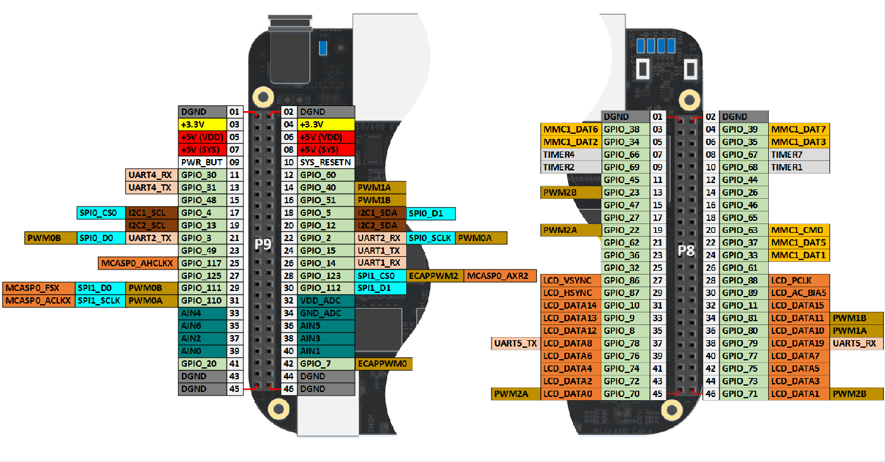

# EC535 Final Project: Electronic Instrument Simulator
## Author: Team 13: Hin Lui Shum, Xulun Huang
Unlisted Youtube Link: [https://youtu.be/dtELEZ3XwHg](https://youtu.be/dtELEZ3XwHg)

## Description
This project is an electronic musical instrument using a BeagleBone Black that allows switching instrument between piano and guitar. An interactive menu controls to switch between different functionalities like recording, playback, and converting recording to MIDI files with assistance from LLM openai

## Features

- **Multiple Instrument Sounds**: Switch between different instruments like piano and guitar.
- **Recording Capability**: Record the sequences of notes played.
- **Playback Functionality**: Play back recorded sequences.
- **Menu System**: Interact with the instrument through a menu system using specific notes to navigate and select options.

## Hardware Requirements
- BeagleBone Black revc
- 16GB micro SD card
- Breadboard and connecting wires
- Push buttons for controls
- 10k Ohms Resistors
- USB port speaker
- USB Hub (Optional)
- USB Wifi Adapter (Optional)

## Software Requirements / Used
- Am335x Debian 11.7
- Python 3.x
- Pygame library for handling audio outputs
- Adafruit_BBIO.GPIO  library for GPIO pin control
- Balena Etcher for flashing drives

## Setup and Installation
With Debian 11.7 installed the login:password would be [debian:temppwd]. Python 3.X comes preinstalled.

1. **Setup Speaker packages**:
   - sudo apt install alsa-utils

3. **Setup Python Environment**:
   - pip install pygame
   - pip install Adafruit_BBIO
   - pip install time
   - pip install openai
   - pip install mido

5. **Clone the Repository**:
   - git clone [https://github.com/yourgithub/yourproject.git](https://github.com/jshumhl/EC535_Project.git)
   
6. **Running the Script:**:
   - python main.py

## Wiring Configuration
- Connect each button to a GPIO pin with a pull-down resistor to ground.
- Connect the USB Speaker via the USB port on the BeagleBone Board
- Follow the circuit below to set up the pins and circuit to the BeagleBone Board

## Usage
1. Start the Device: Run the script as outlined above. The system starts in normal mode with piano sounds by default.
2. Change Instruments: Press the designated instrument switch button to toggle between the available instruments.
3. Recording: Press the menu button to enter the menu, then use the C note to select "Recording" and press the menu button again to start recording. Press the menu button again to stop and save the recording.
4. Playback: Navigate to "Playback" in the menu and select it to hear your recorded sequence.
5. Menu Navigation: Use the note buttons (C, D, E, F, G, A, B) to navigate the menu options.

## Troubleshooting
- Ensure all connections are secure if the buttons do not seem to respond.
- Check the console for error messages if the system behaves unexpectedly.
- Run "speaker-test -c2 -twav -l7" to see if the speaker is functioning
